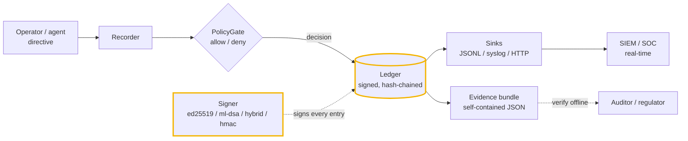

# agentledger

[](https://github.com/cognis-digital/agentledger/actions/workflows/ci.yml)

> Part of the **[Accountable AI Engineering suite](https://github.com/cognis-digital/accountable-ai-suite)** — provable governance for AI agents on infrastructure you own.

**A vendor-neutral flight recorder for AI agents. Every operator directive: signed, hash-chained, policy-gated, and exportable as offline-verifiable evidence.**

Ask yourself:

- When an agent took an action, can you say **who authorized it** — and prove it to an auditor **months later, offline**?
- If someone edited your audit log, would you **know** — or just hope?
- Will the signatures protecting that record still hold up **after quantum computers** arrive?

The hard question in production AI was never "does the model hallucinate." It's *an agent did something — who authorized it, and can you prove it?* — a question for your board, your auditor, and your insurer, and most agent stacks can't answer it. `agentledger` answers it for **any** agent framework, writing down what happened in a form that can't be quietly rewritten:

- **Signed directives.** Every operator instruction is signed — **Ed25519** (asymmetric, anyone can verify origin), **HMAC-SHA256** on the standard library alone, or **post-quantum ML-DSA-65 (FIPS 204)** when you need signatures that survive a quantum adversary.
- **Hash-chained ledger.** Each entry commits to the previous one. Reorder, edit, or delete any entry and the chain breaks at that point — `verify()` tells you exactly where.
- **Policy at the gate.** Directives pass a policy gate *before* being recorded as allowed, so "what was permitted, and under which rule" is part of the evidence — including denied attempts.
- **Offline evidence bundles.** Export the whole history to one JSON file a third party can validate with no database and no call back to any vendor.
- **Framework-agnostic and dependency-light.** It knows nothing about how your agents run. Pure standard library, with Ed25519 as an optional extra.

## Install

```bash
pip install -e .                  # HMAC signing, zero dependencies
pip install -e ".[ed25519]"       # adds Ed25519 (recommended)
```

## Command line

```bash
agentledger keygen --algorithm ed25519 --out agent.key
agentledger submit --action deploy --actor alice --param env=prod --ledger l.db --key agent.key
agentledger outcome --ref 1 --actor agent:deployer --status success --ledger l.db --key agent.key
agentledger rotate --algorithm hybrid --out new.key --ledger l.db --key agent.key   # upgrade to PQC
agentledger verify --ledger l.db                       # chain + signatures + continuity
agentledger export --ledger l.db --out evidence.json
agentledger verify-bundle evidence.json                # offline, no key needed for ed25519/ml-dsa/hybrid
```

## Use it around any agent

```python
from agentledger import Recorder, PolicyGate

# An operator policy: prod deploys need change-control; everything else is fine.
gate = PolicyGate(default_allow=True).deny(
    "deploy", when=lambda d: d["params"].get("env") == "prod",
    reason="prod deploys require change-control", name="no-prod-deploy",
)
rec = Recorder(gate=gate)

decision, entry = rec.submit("alice", "deploy", {"env": "prod"})
if decision.allowed:
    result = run_your_agent(...)
    rec.record_outcome(entry.seq, "agent:deployer", "success", {"build": 421})
else:
    print("blocked:", decision.reason)        # recorded either way

# Prove it
ok, broken = rec.verify()                       # chain + signatures
bundle = rec.export_evidence("evidence.json")   # hand this to an auditor
```

Run `python demo.py` to watch it gate two directives, record outcomes, export an evidence bundle, verify it offline, and catch a tamper attempt end to end.

## How it fits together



See [`docs/ARCHITECTURE.md`](docs/ARCHITECTURE.md) for the full data model and the hash-chain / key-continuity design.

| Component | Role |
|-----------|------|
| **`Recorder`** | The high-level API: `submit` a directive (gated + recorded), `record_outcome`, `verify`, `export_evidence`. |
| **`PolicyGate`** | Glob/predicate allow-deny rules, plus a `.use()` hook to delegate to an external doctrine (e.g. [`sentinel-policy`](https://github.com/cognis-digital/sentinel-policy)). |
| **`Ledger`** | The SQLite-backed, signed, hash-chained entry store. |
| **`Signer` / `Verifier`** | Pluggable backends: `Ed25519` (asymmetric, offline-verifiable) or `HMAC-SHA256` (stdlib). |
| **`evidence`** | `export()` to a self-contained bundle; `verify_bundle()` validates it standalone. |

### Why Ed25519 matters here

With Ed25519, the public key travels inside each entry and the evidence bundle. An auditor verifies the signatures with **only the bundle** — no shared secret, no live service. HMAC still gives you tamper-evidence, but checking signatures then requires the signing secret (the bundle declares `third_party_verifiable: false` so there's no ambiguity).

### Post-quantum signing (shipped, not roadmap)

Evidence you produce today may need to stay verifiable for years — long enough for "harvest now, verify later" to matter. Pick the **ML-DSA-65** backend (NIST FIPS 204) and the directive signatures become quantum-resistant, while everything else — the hash chain, the offline bundle, third-party verification — works identically:

```python
from agentledger import Recorder, PolicyGate
from agentledger.signing import new_signer

rec = Recorder(gate=PolicyGate(default_allow=True), signer=new_signer(prefer="ml-dsa"))
# bundle["algorithm"] == "ml-dsa-65"; verify_bundle(bundle) still works offline
```

Available when your `cryptography` build includes ML-DSA; otherwise pick `ed25519` or `hmac`. For a conservative migration, `new_signer(prefer="hybrid")` signs with **both Ed25519 and ML-DSA-65** — a break in either algorithm alone can't forge a directive.

### Key lifecycle: persistence and rotation with continuity proofs

Keys outlive processes and need to be rotated. Both are first-class:

```python
from agentledger import Recorder, new_signer, save_key, load_key

save_key(signer, "agent.key");  signer = load_key("agent.key")   # persist / reload

rec = Recorder(signer=load_key("agent.key"))
rec.submit("alice", "deploy", {"env": "prod"})
rec.rotate_key(new_signer("hybrid"))      # upgrade to post-quantum, in place
rec.submit("alice", "deploy", {"env": "prod"})
ok, _ = rec.verify()                       # still valid across the rotation
```

Rotation isn't just "start using a new key." `rotate_key` writes a **`key_rotation` entry signed by the *outgoing* key** that names the incoming public key. Verification then enforces **continuity**: a new signing key is accepted only if the previous (already-authorized) key introduced it. An attacker who appends entries with their own key produces individually valid-looking signatures — but the chain rejects the key because nothing authorized it. That's the difference between "each entry is signed" and "the whole history descends from one root of trust."

## Threshold approval (m-of-n)

Some actions shouldn't ride on one person's say-so. Require **m distinct operators** to sign off before a directive counts as authorized — real multi-signature, not a checkbox:

```python
from agentledger import Recorder, load_key

rec = Recorder()
_, directive = rec.submit("alice", "deploy", {"env": "prod"})

rec.approve(directive.seq, "alice", load_key("alice.key"))   # each approver signs
rec.approve(directive.seq, "bob",   load_key("bob.key"))     # with their OWN key

status = rec.approval_status(directive.seq, threshold=2)
status.satisfied        # True — two distinct keys validly signed the directive's hash
```

Each approval is a signature over the directive's hash, so it can't be replayed onto a different action; only **distinct public keys with valid signatures** count (the same operator approving twice counts once), and an optional `allowed_keys` allowlist restricts who may approve. Every approval lands in the same signed, tamper-evident chain. From the CLI:

```bash
agentledger approve --ref 1 --approver alice --approver-key alice.key --ledger l.db --key ledger.key
agentledger approvals --ref 1 --threshold 2 --ledger l.db          # exit 0 when satisfied
```

## Real-time forwarding (SIEM / syslog)

The evidence bundle is the after-the-fact artifact; **sinks** are the live feed. Attach one and every directive, outcome, and key rotation is pushed to your SIEM, syslog, or an HTTP collector the moment it's recorded — so detection and alerting see it in real time, with an independent copy outside the ledger's own database:

```python
from agentledger import Recorder, JSONLinesSink, SyslogSink, HttpSink

rec = Recorder(sinks=[
    JSONLinesSink("/var/log/agentledger.jsonl"),          # append-only file feed
    SyslogSink(address=("siem.internal", 514)),           # to a collector
    HttpSink("https://splunk.internal/services/collector"),# Splunk HEC / webhook
])
```

Sinks are best-effort and isolated: a flaky collector can never block or break the recording of a signed entry — the ledger stays the source of truth.

Purpose-built collector sinks ship too — each accepts an injectable transport so its exact wire output is verified offline in the test suite:

```python
from agentledger import SplunkHecSink, ElasticSink, SignedWebhookSink

rec = Recorder(sinks=[
    SplunkHecSink("https://hec:8088/services/collector", token="…", index="agents"),
    ElasticSink("https://es:9200", index="agentledger"),   # idempotent _bulk (entry_hash as _id)
    SignedWebhookSink("https://hook.example/agent", secret=b"…"),  # HMAC-signed body, GitHub-style
])
```

## Querying, proofs, exporters, and retention

Integrity tells you the record wasn't altered; these additive tools let you *read, prove, export, and archive* it.

**Query** — a chainable, read-only view (never mutates the chain):

```python
from agentledger.query import Query
denied = Query(rec.ledger).kind("directive").denied().since(t0).all()
summary = Query(rec.ledger).summary()   # counts by kind, allowed/denied, distinct actors
```

**Merkle inclusion proofs** — prove a *single* entry belongs to a committed ledger without revealing the others:

```python
from agentledger.merkle import MerkleTree, verify_proof
tree = MerkleTree.from_ledger(rec.ledger)
proof = tree.prove(seq=3)               # O(log n) proof, not the whole ledger
verify_proof(proof, expected_root=tree.root())   # -> True
```

**Exporters** — tool-facing projections on top of the canonical bundle:

```python
from agentledger import exporters
exporters.to_sarif(rec.entries(), "out.sarif")       # denied directives as SARIF 2.1.0 results (CI gate)
exporters.to_otel_spans(rec.entries(), "spans.json") # OpenTelemetry OTLP/JSON (directive+outcomes = a trace)
exporters.to_csv(rec.entries(), "ledger.csv")        # flat triage table
exporters.to_jsonl(rec.entries(), "ledger.jsonl")    # one entry per line
html = exporters.to_html_report(rec.entries(), rec.signer)  # signed, self-contained attestation
exporters.verify_html_attestation(html)              # human-readable AND machine-verifiable
```

**Retention & checkpoints** — seal old history into a signed archive without breaking provability:

```python
from agentledger import RetentionPolicy, seal_segment, verify_checkpoint
res = seal_segment(rec.ledger, rec.signer, RetentionPolicy(keep_last=1000),
                   archive_path="archive.json")
verify_checkpoint(res.checkpoint)   # signed anchor over (archived head hash + Merkle root)
```

**`verify --strict`** — a CI gate that fails the build on any tamper *or* any denied directive on record:

```bash
agentledger verify --ledger l.db --strict   # exit 0 only if intact AND no denials
```

## Demos

Nine runnable scenarios in [`demos/`](demos/), each aimed at a different audience and using the real public API — no network, narrated output, exit 0. Full descriptions in [`docs/DEMOS.md`](docs/DEMOS.md).

```bash
python demos/run_all.py        # all nine, end to end
```

| # | Demo | Audience | What it shows |
|---|------|----------|---------------|
| 1 | [`01_agent_flight_recorder.py`](demos/01_agent_flight_recorder.py) | AI-agent builders | Gate a directive, run the agent on allow, record the outcome — and record the denied directive too. |
| 2 | [`02_tamper_evident_audit.py`](demos/02_tamper_evident_audit.py) | Security & compliance | Edit one row in SQLite and watch `verify()` catch it and point at the exact sequence. |
| 3 | [`03_offline_evidence_bundle.py`](demos/03_offline_evidence_bundle.py) | Auditors / regulators | Export a bundle, verify it offline with no key and no network, then catch a single edited field. |
| 4 | [`04_key_rotation_and_pqc.py`](demos/04_key_rotation_and_pqc.py) | Platform & security engineers | Rotate Ed25519 → post-quantum ML-DSA-65 in place; an unauthorized key is rejected by continuity. |
| 5 | [`05_threshold_and_siem.py`](demos/05_threshold_and_siem.py) | SRE / platform ops | Require m-of-n distinct operator approvals while forwarding the feed to a SIEM sink in real time. |
| 6 | [`06_query_the_ledger.py`](demos/06_query_the_ledger.py) | Auditors / on-call | Filter a trusted ledger read-only: every denial, one actor's actions, a directive's outcomes, an aggregate. |
| 7 | [`07_merkle_inclusion_proof.py`](demos/07_merkle_inclusion_proof.py) | Compliance / privacy | Publish one Merkle root, then prove a single entry's inclusion without disclosing the others. |
| 8 | [`08_exporters_for_tooling.py`](demos/08_exporters_for_tooling.py) | Platform / DevSecOps | Project the ledger into SARIF, OpenTelemetry spans, CSV/JSONL, and a signed HTML attestation. |
| 9 | [`09_retention_and_checkpoint.py`](demos/09_retention_and_checkpoint.py) | Data governance | Seal old history into a signed archive + checkpoint; a single archived entry stays provable. |

## Composition

`agentledger` records and proves; it doesn't try to be your whole governance doctrine. Point its policy gate at [`sentinel-policy`](https://github.com/cognis-digital/sentinel-policy) for a full rule set, and feed directives in front of agents on any framework.

## Testing

```bash
pip install -e ".[dev]"
pytest -q          # 101 tests
```

## License

COCL (Cognis Open Collaboration License). © Cognis Digital.

> Status: v0.2 — runnable and tested. Shipped: post-quantum ML-DSA-65 signing, hybrid Ed25519+ML-DSA signatures, persistent keys, key rotation with continuity proofs, threshold m-of-n approval, real-time SIEM/syslog/HTTP sinks, Splunk HEC / Elastic / signed-webhook sinks, a read-only query API, Merkle single-entry inclusion proofs, SARIF / OpenTelemetry / CSV / JSONL / signed-HTML exporters, retention sealing with signed checkpoints, a `verify --strict` CI gate, and a CLI.
