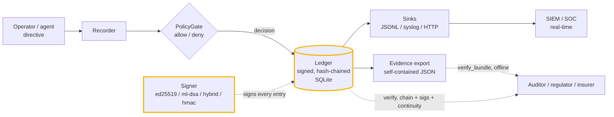
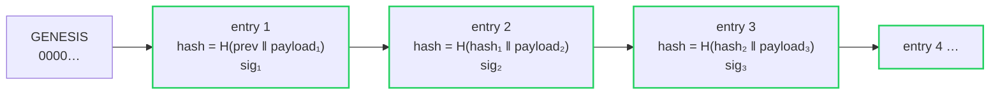
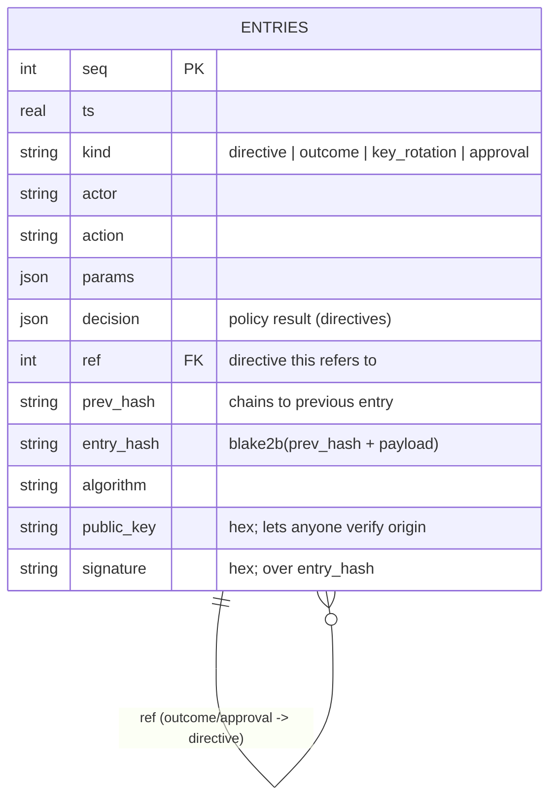

# Architecture

`agentledger` is a vendor-neutral flight recorder for AI agents. It sits in
front of *any* agent framework and writes down what an operator told the agent
to do, whether policy allowed it, and what happened — in a form that can't be
quietly rewritten and that a third party can verify offline, even years later.
This document explains how the pieces fit together, end to end.

## The pipeline

A directive enters through the **Recorder**, is evaluated by the **PolicyGate**
(allowed *or* denied — both are recorded), and is appended to the **Ledger** as
a signed, hash-chained entry. Each entry fans out to any attached **sinks** in
real time, and the whole history can be exported as a self-contained
**evidence bundle** that an outside party validates with no database and no
vendor call.

## Components

### Recorder (`agentledger/recorder.py`)
The high-level API most callers use. `submit(actor, action, params)` evaluates a
directive against the gate and records it (signed) regardless of the outcome;
`record_outcome(ref_seq, ...)` records what the agent actually did;
`rotate_key`, `approve`/`approval_status`, `verify`, and `export_evidence` round
it out. It deliberately knows nothing about how your agents run.

### PolicyGate (`agentledger/policy.py`)
Glob-matched allow/deny rules with optional predicates (`when=lambda d: ...`),
evaluated in declaration order with first-match-wins. A `.use(evaluator)` hook
delegates to an external doctrine (e.g. [`sentinel-policy`](https://github.com/cognis-digital/sentinel-policy))
for the rich rule set, while agentledger only needs a `Decision`. The decision —
including *why* something was denied — is stored as part of the evidence.

### Ledger (`agentledger/ledger.py`)
A single SQLite table of entries. Two integrity mechanisms stack on every row:

1. **Hash chaining** — an entry's `entry_hash = blake2b(prev_hash ‖ canonical(payload))`,
   so reordering, editing, or deleting any entry breaks the chain from that point.
2. **Signature** — the signer signs `entry_hash`, binding the entry to a key.

`verify()` replays both and returns the first sequence number that fails. It
*also* enforces **key continuity** (below).

### Signer / Verifier (`agentledger/signing.py`)
Pluggable backends behind one interface:

| Backend | Algorithm | Third-party verifiable offline? | Notes |
|---------|-----------|--------------------------------|-------|
| `Ed25519` | `ed25519` | yes | default; public key travels in each entry |
| `MLDSA65` | `ml-dsa-65` | yes | post-quantum (NIST FIPS 204) |
| `Hybrid` | `hybrid-ed25519-ml-dsa-65` | yes | signs with both; a break in either alone can't forge |
| `HMAC` | `hmac-sha256` | no (needs the secret) | standard library only, zero dependencies |

`new_signer(prefer=...)` constructs one, degrading to HMAC when `cryptography`
is absent. `save_key` / `load_key` persist and reload a signer.

#### Key rotation with continuity proofs
`rotate_key` writes a `key_rotation` entry **signed by the outgoing key** that
names the incoming public key. Verification then enforces continuity: a new
signing key is accepted only if a prior, already-authorized key introduced it.
An attacker who appends entries with their own key produces individually
valid-looking signatures, but the chain rejects the key because nothing
authorized it — the difference between "each entry is signed" and "the whole
history descends from one root of trust."

### Evidence (`agentledger/evidence.py`)
`export()` serializes the entire ledger plus the metadata needed to check it —
into one JSON document. `verify_bundle()` reconstructs the hash chain, every
signature (for asymmetric algorithms), and the key-continuity rule from the
bundle alone. For HMAC bundles the file honestly declares
`third_party_verifiable: false`, and checking signatures then requires the
secret.

### Sinks (`agentledger/sinks.py`)
Real-time fan-out. `JSONLinesSink`, `SyslogSink`, `HttpSink`, and `CallableSink`
each receive every entry the moment it's recorded, giving detection and alerting
a live, independent copy outside the ledger's own database. A `SinkDispatcher`
isolates each sink's failures so a flaky collector can never block or break the
recording of a signed entry — the ledger stays the source of truth.

### CLI (`agentledger/cli.py`)
`keygen`, `submit`, `outcome`, `rotate`, `approve`, `approvals`, `verify`,
`export`, and `verify-bundle` expose the same capabilities to scripts and CI.
Exit codes are meaningful (e.g. `submit` exits non-zero on a denied directive;
`verify` exits non-zero on a broken chain).

## Data model

Every event — directive, outcome, key rotation, approval — is one row in this
single table, chained to the one before it.

## Why these choices

- **SQLite, no server.** The ledger is a file you can copy, diff, and ship; the
  evidence bundle is a file an auditor can validate with nothing but a JSON
  parser and a signature check. No daemon to operate, no data leaving your host.
- **Framework-agnostic.** agentledger records and proves; it does not try to be
  your agent runtime or your whole governance doctrine. Point the gate at an
  external policy engine and feed it directives in front of agents on any stack.
- **Provable by construction.** The hash chain and signature are the path every
  entry takes, not a feature bolted on. "Who authorized this, and can you prove
  it offline, months later" is answerable because the record was built that way.
- **Quantum-aware.** ML-DSA-65 and the hybrid mode ship today, so records signed
  now can stay verifiable against a future quantum adversary ("harvest now,
  verify later").
